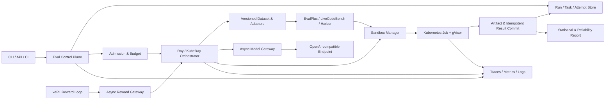

# VeriRun

**Evidence-first infrastructure for reproducible, isolated executable evaluation and online rewards.**

> [!IMPORTANT]
> VeriRun is pre-alpha. **The latest release is [v0.3.0](https://github.com/aaron-for-value/VeriRun/releases/tag/v0.3.0): isolated execution tiers with a narrowly scoped local Kubernetes/gVisor evidence boundary.**
> v0.1's local executor remains for trusted fixtures only and is not a security boundary;
> do not use it for model-generated or otherwise untrusted code.

VeriRun is a distributed runtime for code and agent evaluation workloads whose results must be reproducible, recoverable, attributable, and safe enough for the declared threat model. It is designed to run versioned benchmarks, preserve complete execution lineage, separate model failures from infrastructure failures, and expose the same verifier path to asynchronous post-training reward loops.

VeriRun is not another leaderboard. It is the runtime underneath trustworthy executable evaluation and reward computation.

## Why VeriRun

Open-source benchmark harnesses are good at answering a workload-specific question: *how do I run this benchmark?* Operating executable evaluation at scale introduces a different set of problems:

- model requests are asynchronous, rate-limited, expensive, and cancellable;
- generated programs and agent environments are untrusted;
- tasks are heterogeneous and have long-tail runtimes;
- retries can silently create duplicate work or inconsistent results;
- benchmark, prompt, test, model, and runner versions all affect the score;
- a model failure, verifier defect, sandbox failure, and scheduler failure must not look identical;
- offline evaluation and online training reward need different latency semantics but the same provenance guarantees.

VeriRun treats these as first-class runtime concerns instead of leaving them to ad hoc scripts around a benchmark harness.

## Core guarantees

VeriRun is being built around six invariants:

1. **Immutable provenance** — every result identifies the benchmark, prompt, candidate, tests, verifier image, model revision, sampling configuration, and runtime policy that produced it.
2. **Replay before claims** — frozen candidates can be verified again without calling the model, and replay differences are classified rather than hidden.
3. **Structured failure semantics** — compile errors, test failures, timeouts, OOMs, policy violations, and infrastructure failures remain distinct.
4. **Isolation is evidence, not a checkbox** — security claims require an explicit threat model and attack regression suite on the stated Linux/Kubernetes/gVisor environment.
5. **At-least-once execution, effectively-once results** — retries may repeat attempts; idempotent commit prevents multiple final results.
6. **Capability and infrastructure quality are reported separately** — unreliable runs are marked partial or invalid instead of publishing misleading benchmark conclusions.

These are design targets until the corresponding roadmap gate is completed and linked to reproducible evidence.

## Target architecture

The architecture is delivered incrementally. Components shown here are not all implemented today.



The control plane owns intent and durable state. The execution plane performs retryable attempts. Benchmark adapters preserve upstream workload semantics instead of reimplementing EvalPlus, LiveCodeBench, Harbor, or Terminal-Bench.

## Delivery status

| Capability | Target | Status |
|---|---|---|
| Immutable manifests, hashing, structured verification, deterministic replay | v0.1 | **Released (v0.1.0)** |
| Bounded async model gateway with cancellation and classified retries | v0.2 | **Released (v0.2.0)** |
| Digest-pinned container development backend; restricted Kubernetes + gVisor Job contract | v0.3 | **Released (v0.3.0); local kind/gVisor evidence only** |
| Durable run state, frozen plans, leases, recovery, S3 artifacts, and idempotent commit | v0.4 | **Verification — M3 implemented; release evidence pending** |
| Ray/KubeRay execution with bounded in-flight work and failure recovery | v0.5 | Planned |
| OpenTelemetry, capacity/chaos evidence, and statistically valid reports | v0.6 | Planned |
| veRL asynchronous reward integration | v0.7 | Planned |
| Harbor / Terminal-Bench agent workload integration | v0.8 | Optional |

See the evidence gates and current work in the [Roadmap](ROADMAP.md).

## v0.1 protocol foundation

v0.1.0 established the protocol baseline before distributed infrastructure was introduced.

v0.1.0 provides:

- a versioned `EvalManifest` contract;
- content hashes for benchmark data, prompts, candidates, tests, and runner artifacts;
- structured `VerificationResult` records;
- an explicit executor boundary with a development-only local backend;
- EvalPlus oracle, obvious-failure, and boundary-failure fixtures;
- frozen-candidate replay and a machine-readable comparison report;
- automated tests for protocol handling, result classification, timeouts, and replay consistency;
- a CLI that produces artifacts without requiring a model endpoint.

A small frozen subset will be used for development smoke tests. Any published HumanEval+ or MBPP+ benchmark claim will require the standard versioned workload and protocol; subset results will be labeled as subset results.

## M0 complete-workload evidence

The post-v0.1 M0 addendum exercises the full HumanEval+ and MBPP+ ordered workloads
with deterministic canonical and obvious-failure fixtures, Base/Plus split reporting,
two replays, and five Plus-only boundary catches. It is verifier/replay evidence, not
a model score or a new v0.1.0 release claim. See the [M0 evidence guide](docs/M0_EVALPLUS_EVIDENCE.md)
and its generated [task-level report](evidence/m0/evalplus/REPORT.md).

The full gate is manually reproducible in GitHub Actions through **EvalPlus M0 full
workload**. It must be regenerated from a clean revision before it is presented as
merged or release evidence.

## v0.2: async generation gateway

v0.2 adds a bounded OpenAI-compatible candidate-generation gateway. It keeps
concurrency, QPS, and in-flight token limits separate, uses a long-lived async HTTP
connection pool, and records classified retry history. It is not a model-provider
performance or exactly-once generation claim.

Run the local deterministic fault exercise without credentials:

```bash
./.venv/bin/python -m verirun gateway-smoke --output evidence/v0.2/gateway-smoke
```

The command covers 429, 5xx, slow response, disconnect, malformed JSON, bounded
backpressure, a directional local submission comparison, and an event-loop watchdog:
a fast request and heartbeat continue while a slow upstream response is pending, while
a deliberate synchronous block is detected. The test suite also checks cancellation
cleanup. See [the async gateway contract](docs/ASYNC_GATEWAY.md) for policy boundaries.

The [v0.2.0 release](https://github.com/aaron-for-value/VeriRun/releases/tag/v0.2.0)
includes the local fault evidence and versioned gateway schemas. It does not add a
provider-compatibility, model-quality, or exactly-once generation claim.

## Workloads

VeriRun plans to integrate existing workload implementations rather than replace them:

- **EvalPlus** — HumanEval+ and MBPP+ are the primary protocol and verifier workloads.
- **LiveCodeBench** — a fixed release will provide a time-scoped code-generation workload.
- **Harbor / Terminal-Bench 2.0** — an optional, explicitly labeled subset will validate agent environment, rollout, and verifier attribution.

The adapter boundary is part of the product: upstream harness behavior stays upstream; VeriRun owns orchestration, lineage, isolation policy, recovery, artifacts, and unified reporting.

## Trust and safety model

Executable evaluation means running untrusted code. VeriRun will not use vague claims such as “the container makes it safe.”

- The local executor is for protocol development and trusted fixtures only. It is not a security boundary.
- A container backend reduces some operational risk but does not, by itself, satisfy the final isolation gate.
- Security evidence requires Linux/Kubernetes testing with restricted pod settings, seccomp, denied network paths, resource limits, and a gVisor `RuntimeClass`.
- The attack suite will cover infinite loops, memory exhaustion, process bombs, host-file reads, network access, disk exhaustion, stdout flooding, and signal-handling escape attempts.
- Residual risks and environment assumptions will be published alongside results.

If you discover a security issue, do not open a public issue. Follow the private reporting process in [SECURITY.md](SECURITY.md).

## Evidence over screenshots

A feature is not complete because a dashboard or happy-path demo exists. Release evidence will include, as applicable:

- immutable manifests and compatibility matrices;
- raw structured results and content-addressed artifacts;
- replay comparisons;
- automated unit, integration, attack, and recovery tests;
- concurrency curves with environment and sample-size metadata;
- capacity and chaos reports;
- trace-to-attempt-to-artifact correlation;
- confidence intervals and infrastructure exclusion policy;
- known limitations and residual risks.

Performance goals will be relative to measured baselines. VeriRun will not claim arbitrary “10×” improvements or production-scale readiness from a laptop experiment.

## Non-goals

VeriRun will not:

- become a general-purpose MLOps platform;
- build a leaderboard-first product;
- reimplement EvalPlus, Harbor, Terminal-Bench, or a training framework;
- start with a large UI before the runtime is correct;
- run full SWE-bench or become a general software-engineering agent platform;
- describe a local subprocess, a default container, or gVisor itself as absolute security;
- present small-subset or small-cluster experiments as full benchmark or production claims.

## GitHub operating model

VeriRun will use GitHub as the public operating system for the project, not only as a code mirror:

- **Milestones** represent evidence-gated releases.
- **Issues** represent independently verifiable work, defects, design questions, and experiments.
- **Pull requests** link an issue, tests, documentation, and the evidence affected by the change.
- **GitHub Actions** enforce formatting, typing, tests, security checks, and reproducibility checks as those layers land.
- **Releases** publish signed scope, compatibility, evidence, and known limitations.
- **Discussions** may be enabled for design proposals and user questions once a usable release exists.

The detailed label taxonomy, issue requirements, and release gates are in the [Roadmap](ROADMAP.md#github-execution-model).

## Repository map

The repository keeps protocol, implementation, evidence, and governance artifacts explicit:

```text
VeriRun/
├── src/verirun/        # Protocol, artifacts, executors, adapters, replay, and CLI
├── tests/              # Unit, classification, adapter, and replay tests
├── schemas/            # CI-checked public JSON Schemas
├── evidence/           # Reproducible milestone evidence (added after clean runs)
├── docs/               # ADRs, compatibility, and versioning policy
├── BENCHMARK_PROTOCOL.md
├── ROADMAP.md
└── .github/            # CI, ownership, issue forms, and pull-request template
```

Infrastructure is added only when the milestone that owns its contract can also provide acceptance evidence.

## Installation and development

The supported development environment is Python 3.12 in a project-local environment:

```bash
conda create --prefix .venv python=3.12 pip -y
./.venv/bin/python -m pip install -r requirements/core-dev.lock.txt
./.venv/bin/python -m pip install -e . --no-deps
make lint typecheck schemas test-unit build smoke
```

The PostgreSQL and S3-compatible M3 interfaces use the separately declared
control-plane dependency set:

```bash
./.venv/bin/python -m pip install -e '.[control-plane]'
```

The full `make check` coverage gate includes live PostgreSQL and S3 integration tests.
Start the pinned local fixture and export the test variables described in the
[control-plane guide](docs/CONTROL_PLANE.md) before running it.

Run the trusted synthetic protocol and replay smoke directly with:

```bash
./.venv/bin/python -m verirun smoke --output evidence/v0.1/synthetic
```

The pinned EvalPlus adapter remains optional because its upstream dependency tree is substantially larger than VeriRun core:

```bash
./.venv/bin/python -m pip install -r requirements/evalplus-v0.1.lock.txt
./.venv/bin/python -m pip install -e . --no-deps
./.venv/bin/python -m verirun evalplus-smoke --output evidence/v0.1/evalplus
```

The EvalPlus command runs a labeled three-task HumanEval+ compatibility subset twice. It does not produce a standard benchmark score. See [BENCHMARK_PROTOCOL.md](BENCHMARK_PROTOCOL.md) for the exact claim boundary.

## v0.3 isolated-execution tiers

v0.3 introduced the isolated-execution work with a digest-pinned Docker development
tier. It rejects mutable images, disables networking, uses a read-only filesystem,
runs as non-root with no capabilities, applies memory/PID limits, and treats failed
container cleanup as an infrastructure error. The exact threat model, command
contract, residual risks, and local recipe are in
[`docs/ISOLATED_EXECUTION.md`](docs/ISOLATED_EXECUTION.md).

This tier reduces local operational risk only. It is not a security sandbox claim,
and neither macOS nor a default Docker runtime is presented as Linux/Kubernetes/gVisor
evidence.

The same manifest family now also has an explicit Kubernetes Job tier: it requires a
digest-pinned image, explicit context/namespace/`RuntimeClass`, default-deny egress
preflight, restricted Pod settings, bounded logs, zero Job retries, and cleanup. It
has passed a local kind/gVisor attack matrix with a checked-in
[clean-revision report](evidence/v0.3/kubernetes-smoke/REPORT.md) and a
[v0.3.0 release evidence asset](https://github.com/aaron-for-value/VeriRun/releases/tag/v0.3.0).
It is not a broad security claim. See
[`docs/ISOLATED_EXECUTION.md`](docs/ISOLATED_EXECUTION.md).

Run the reproducible development-container smoke only after pre-pulling an exact
digest for the local architecture:

```bash
VERIRUN_CONTAINER_IMAGE='python@sha256:<64-hex-digest>' make container-smoke
```

It records pass, timeout, read-only-workspace, and no-network scenarios twice. The
generated report is development-container evidence, not a release or gVisor claim.

For a provisioned Kubernetes namespace with a `default-deny-egress` policy and a
verified `gvisor` RuntimeClass, run the stronger local runtime matrix:

```bash
VERIRUN_CONTAINER_IMAGE='python@sha256:<64-hex-digest>' \
VERIRUN_KUBERNETES_CONTEXT='kind-verirun-m2' \
VERIRUN_KUBERNETES_NAMESPACE='verirun-m2-live' \
VERIRUN_KUBERNETES_RUNTIME_CLASS='gvisor' \
make kubernetes-smoke
```

It records a pass control plus timeout, output-flood, OOM, egress, read-only-root,
privilege-escalation, invalid-source, and artifact-tamper probes twice. The report is
written under `.verirun/evidence/v0.3/kubernetes-smoke/`; use `make
evidence-kubernetes` only to refresh checked-in evidence from a clean revision.

EvalPlus v0.3.1's memory `setrlimit` path is incompatible with Darwin on the current supported macOS environment. For this built-in deterministic trusted smoke only, macOS evidence is run with `EVALPLUS_MAX_MEMORY_BYTES=-1`; the setting is recorded in the report. Linux verification keeps the upstream default. Neither path is sandbox evidence.

## v0.4 durable control plane

M3 now has an implementation under release verification. It adds a deterministic,
versioned `VerificationPlan`; PostgreSQL-backed plan/run/task/attempt/result/command and
artifact metadata; lease, heartbeat, expiry and takeover semantics; caller idempotency
keys; cohort preflight/splitting; and SHA-256-addressed S3-compatible artifact storage.

Only a validated and frozen plan can be scheduled. Candidate/model output is excluded
from plan selection, and every durable task, attempt, and final result retains the
same plan digest. Attempts remain at least once; the database enforces one authoritative
result for `run + task + candidate + plan digest` and rejects changed repeated payloads.

The typed CLI starts at `verirun control`. The full architecture, lifecycle, command
examples, recovery procedure, and limitations are in the
[durable control-plane guide](docs/CONTROL_PLANE.md). The checked-in
[M3 recovery report](evidence/v0.4/control-plane/REPORT.md) covers a local PostgreSQL
16 + MinIO smoke. Until v0.4.0 is tagged and its final CI/evidence is published, the
latest supported release remains v0.3.0.

## v0.1 evidence

The checked-in v0.1.0 release evidence is bound to implementation revision `b30b11d2e3e1b20ad7c3b7e3df3f314ae7d6a64c`:

- [Synthetic protocol and replay report](evidence/v0.1/synthetic/REPORT.md) — five outcome classes, each executed twice with matching semantic replay identity.
- [EvalPlus compatibility report](evidence/v0.1/evalplus/REPORT.md) — three HumanEval+ tasks, deterministic oracle and failure recipes, each executed twice through the official EvalPlus path.

These reports prove the v0.1 development contract on the recorded macOS/Python environment. GitHub CI and the [Linux EvalPlus workflow](https://github.com/aaron-for-value/VeriRun/actions/runs/31953267994) both passed; neither report is a model score or sandbox claim.

## Contributing

Read [CONTRIBUTING.md](CONTRIBUTING.md) before opening an issue or pull request. Design feedback should be tied to a concrete invariant, failure mode, or roadmap gate. Technology adoption alone is not a project outcome.

Security vulnerabilities must follow the private process in [SECURITY.md](SECURITY.md). Community participation is governed by the [Code of Conduct](CODE_OF_CONDUCT.md).

## Project principles

- Reproduce before optimizing.
- Preserve attempts; commit one final result.
- Treat cancellation and backpressure as correctness concerns.
- Attribute every failure before retrying it.
- Add infrastructure only when a measured requirement justifies it.
- Make every public claim traceable to environment, version, workload, and evidence.

## License

VeriRun is licensed under the [Apache License 2.0](LICENSE).
