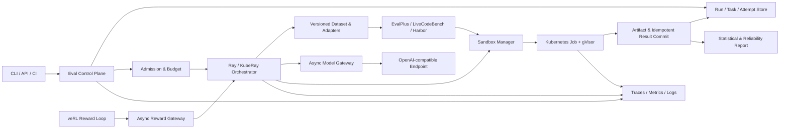

# VeriRun

**Evidence-first infrastructure for reproducible, isolated executable evaluation and online rewards.**

> [!IMPORTANT]
> VeriRun is pre-alpha. The repository is establishing its public contracts and delivery roadmap; there is no supported runnable release yet. Do not execute model-generated code on a host machine based on this repository.

VeriRun is a distributed runtime for code and agent evaluation workloads whose results must be reproducible, recoverable, attributable, and safe enough for the declared threat model. It is designed to run versioned benchmarks, preserve complete execution lineage, separate model failures from infrastructure failures, and expose the same verifier path to asynchronous post-training reward loops.

VeriRun is not another leaderboard. It is the runtime underneath trustworthy executable evaluation and reward computation.

## Why VeriRun

Open-source benchmark harnesses are good at answering a workload-specific question: *how do I run this benchmark?* Operating executable evaluation at scale introduces a different set of problems:

- model requests are asynchronous, rate-limited, expensive, and cancellable;
- generated programs and agent environments are untrusted;
- tasks are heterogeneous and have long-tail runtimes;
- retries can silently create duplicate work or inconsistent results;
- benchmark, prompt, test, model, and runner versions all affect the score;
- a model failure, verifier defect, sandbox failure, and scheduler failure must not look identical;
- offline evaluation and online training reward need different latency semantics but the same provenance guarantees.

VeriRun treats these as first-class runtime concerns instead of leaving them to ad hoc scripts around a benchmark harness.

## Core guarantees

VeriRun is being built around six invariants:

1. **Immutable provenance** — every result identifies the benchmark, prompt, candidate, tests, verifier image, model revision, sampling configuration, and runtime policy that produced it.
2. **Replay before claims** — frozen candidates can be verified again without calling the model, and replay differences are classified rather than hidden.
3. **Structured failure semantics** — compile errors, test failures, timeouts, OOMs, policy violations, and infrastructure failures remain distinct.
4. **Isolation is evidence, not a checkbox** — security claims require an explicit threat model and attack regression suite on the stated Linux/Kubernetes/gVisor environment.
5. **At-least-once execution, effectively-once results** — retries may repeat attempts; idempotent commit prevents multiple final results.
6. **Capability and infrastructure quality are reported separately** — unreliable runs are marked partial or invalid instead of publishing misleading benchmark conclusions.

These are design targets until the corresponding roadmap gate is completed and linked to reproducible evidence.

## Target architecture

The architecture is delivered incrementally. Components shown here are not all implemented today.



The control plane owns intent and durable state. The execution plane performs retryable attempts. Benchmark adapters preserve upstream workload semantics instead of reimplementing EvalPlus, LiveCodeBench, Harbor, or Terminal-Bench.

## Delivery status

| Capability | Target | Status |
|---|---|---|
| Immutable manifests, hashing, structured verification, deterministic replay | v0.1 | Planned |
| Bounded async model gateway with cancellation and classified retries | v0.2 | Planned |
| Container development backend and Kubernetes + gVisor validation backend | v0.3 | Planned |
| Durable run state, leases, heartbeats, replay, and idempotent commit | v0.4 | Planned |
| Ray/KubeRay execution with bounded in-flight work and failure recovery | v0.5 | Planned |
| OpenTelemetry, capacity/chaos evidence, and statistically valid reports | v0.6 | Planned |
| veRL asynchronous reward integration | v0.7 | Planned |
| Harbor / Terminal-Bench agent workload integration | v0.8 | Optional |

See the evidence gates and current work in the [Roadmap](ROADMAP.md).

## First usable release: v0.1

v0.1 will establish the protocol baseline before distributed infrastructure is introduced.

It will provide:

- a versioned `EvalManifest` contract;
- content hashes for benchmark data, prompts, candidates, tests, and runner artifacts;
- structured `VerificationResult` records;
- an explicit executor boundary with a development-only local backend;
- EvalPlus oracle, obvious-failure, and boundary-failure fixtures;
- frozen-candidate replay and a machine-readable comparison report;
- automated tests for protocol handling, result classification, timeouts, and replay consistency;
- a CLI that produces artifacts without requiring a model endpoint.

A small frozen subset will be used for development smoke tests. Any published HumanEval+ or MBPP+ benchmark claim will require the standard versioned workload and protocol; subset results will be labeled as subset results.

## Workloads

VeriRun plans to integrate existing workload implementations rather than replace them:

- **EvalPlus** — HumanEval+ and MBPP+ are the primary protocol and verifier workloads.
- **LiveCodeBench** — a fixed release will provide a time-scoped code-generation workload.
- **Harbor / Terminal-Bench 2.0** — an optional, explicitly labeled subset will validate agent environment, rollout, and verifier attribution.

The adapter boundary is part of the product: upstream harness behavior stays upstream; VeriRun owns orchestration, lineage, isolation policy, recovery, artifacts, and unified reporting.

## Trust and safety model

Executable evaluation means running untrusted code. VeriRun will not use vague claims such as “the container makes it safe.”

- The local executor is for protocol development and trusted fixtures only. It is not a security boundary.
- A container backend reduces some operational risk but does not, by itself, satisfy the final isolation gate.
- Security evidence requires Linux/Kubernetes testing with restricted pod settings, seccomp, denied network paths, resource limits, and a gVisor `RuntimeClass`.
- The attack suite will cover infinite loops, memory exhaustion, process bombs, host-file reads, network access, disk exhaustion, stdout flooding, and signal-handling escape attempts.
- Residual risks and environment assumptions will be published alongside results.

If you discover a security issue, do not open a public issue. A private reporting process will be published before the first executable release.

## Evidence over screenshots

A feature is not complete because a dashboard or happy-path demo exists. Release evidence will include, as applicable:

- immutable manifests and compatibility matrices;
- raw structured results and content-addressed artifacts;
- replay comparisons;
- automated unit, integration, attack, and recovery tests;
- concurrency curves with environment and sample-size metadata;
- capacity and chaos reports;
- trace-to-attempt-to-artifact correlation;
- confidence intervals and infrastructure exclusion policy;
- known limitations and residual risks.

Performance goals will be relative to measured baselines. VeriRun will not claim arbitrary “10×” improvements or production-scale readiness from a laptop experiment.

## Non-goals

VeriRun will not:

- become a general-purpose MLOps platform;
- build a leaderboard-first product;
- reimplement EvalPlus, Harbor, Terminal-Bench, or a training framework;
- start with a large UI before the runtime is correct;
- run full SWE-bench or become a general software-engineering agent platform;
- describe a local subprocess, a default container, or gVisor itself as absolute security;
- present small-subset or small-cluster experiments as full benchmark or production claims.

## GitHub operating model

VeriRun will use GitHub as the public operating system for the project, not only as a code mirror:

- **Milestones** represent evidence-gated releases.
- **Issues** represent independently verifiable work, defects, design questions, and experiments.
- **Pull requests** link an issue, tests, documentation, and the evidence affected by the change.
- **GitHub Actions** enforce formatting, typing, tests, security checks, and reproducibility checks as those layers land.
- **Releases** publish signed scope, compatibility, evidence, and known limitations.
- **Discussions** may be enabled for design proposals and user questions once a usable release exists.

The detailed label taxonomy, issue requirements, and release gates are in the [Roadmap](ROADMAP.md#github-execution-model).

## Repository map

The repository is intentionally small during foundation work:

```text
VeriRun/
├── README.md           # Product contract, architecture, status, and trust boundaries
├── ROADMAP.md          # Evidence-gated releases and GitHub execution model
├── CONTRIBUTING.md     # Contribution and evidence contract
├── SECURITY.md         # Private vulnerability reporting and security scope
├── CODE_OF_CONDUCT.md  # Community participation standards
├── .github/            # Ownership, issue forms, and pull-request template
└── docs/               # Architecture, ADRs, protocols, and evidence reports (planned)
```

Source code, tests, examples, deployment manifests, and reports will be added only with the milestone that owns their contract.

## Installation and development

There is no supported installation yet. The first development environment will target Python 3.12 with a locked, project-local dependency environment.

The v0.1 gate includes reproducible setup instructions and a runnable CLI. Until that gate is met, commands shown in design discussions must not be treated as a stable interface.

## Contributing

Read [CONTRIBUTING.md](CONTRIBUTING.md) before opening an issue or pull request. Design feedback should be tied to a concrete invariant, failure mode, or roadmap gate. Technology adoption alone is not a project outcome.

Security vulnerabilities must follow the private process in [SECURITY.md](SECURITY.md). Community participation is governed by the [Code of Conduct](CODE_OF_CONDUCT.md).

## Project principles

- Reproduce before optimizing.
- Preserve attempts; commit one final result.
- Treat cancellation and backpressure as correctness concerns.
- Attribute every failure before retrying it.
- Add infrastructure only when a measured requirement justifies it.
- Make every public claim traceable to environment, version, workload, and evidence.

## License

VeriRun is licensed under the [Apache License 2.0](LICENSE).
